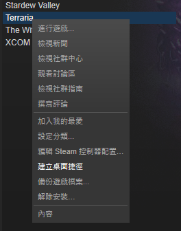
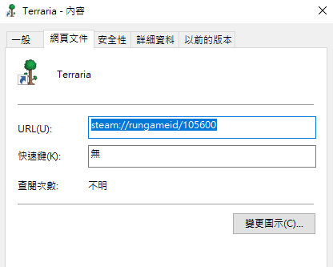
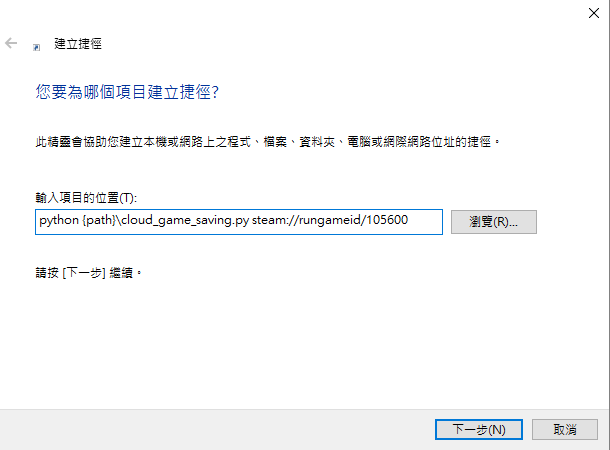
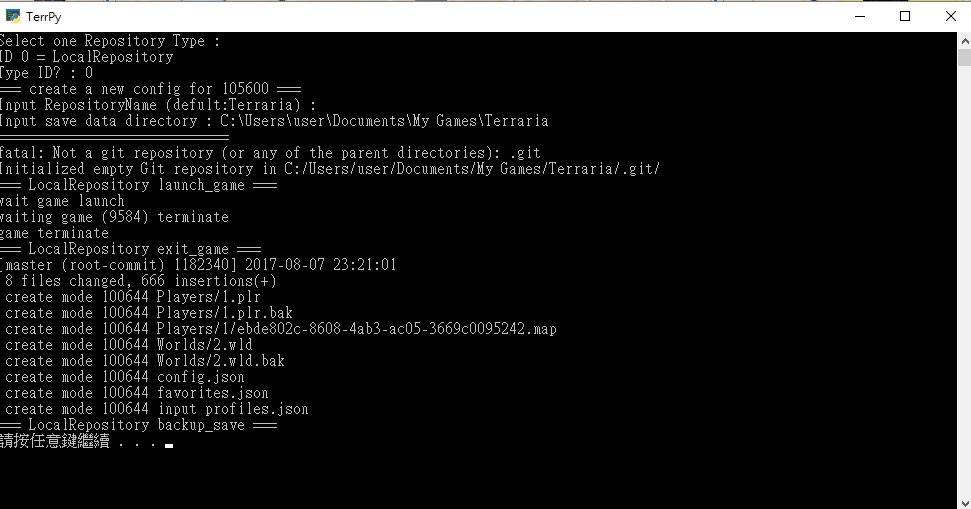

# PyCloudGameSaving

Game save data vision control with git
---
## Platform 
```
windows
```
---
## Prerequisites

### [git](https://git-scm.com/)
### [Python3](https://www.python.org/)
* requests
* psutil

---
## Installing

Just download

```
git clone 
```

## Example (Execution file)
```
python {PyCloudGameSaving PATH}\cloud_game_saving.py {GAME DIR}\RPG_RT.exe
```

## Example (Steam)
### Command line
```
python {PyCloudGameSaving PATH}\cloud_game_saving.py steam://rungameid/{appid}
```
### Create shortcut
`create shortcut in Desktop`  
  
`Copy url`  
  
```
Create own shortcut
ex : python {PyCloudGameSaving PATH}\cloud_game_saving.py steam://rungameid/{appid}
```  
 

 

---
## Configuration File

First lanuch system will lead you to create {name}.json
```
{
    "RepositoryName": "Terraria"
    , "save_dir": "C:\\Users\\user\\Documents\\My Games\\Terraria"
    , "RepositoryType": "LocalRepository"
    , "launch_target": "steam://rungameid/105600"
    , "wait_second": 30
}
```
### Attributes
* *RepositoryName* : RepositoryName
* *save_dir* : game save data location 
* *RepositoryType* : RepositoryType
* *launch_target* : start command
* *wait_second* : for steam game sleep(wait_second) then fetch game pid
---
## RepositoryType

### LocalRepository
vision control in local Repository

```
Just run 
git add .
git commit 
```

# To be continued....

## Authors

* **OldNick** - *Initial work* - [sd12582000](https://github.com/sd12582000)

## License

This project is licensed under the MIT License 
